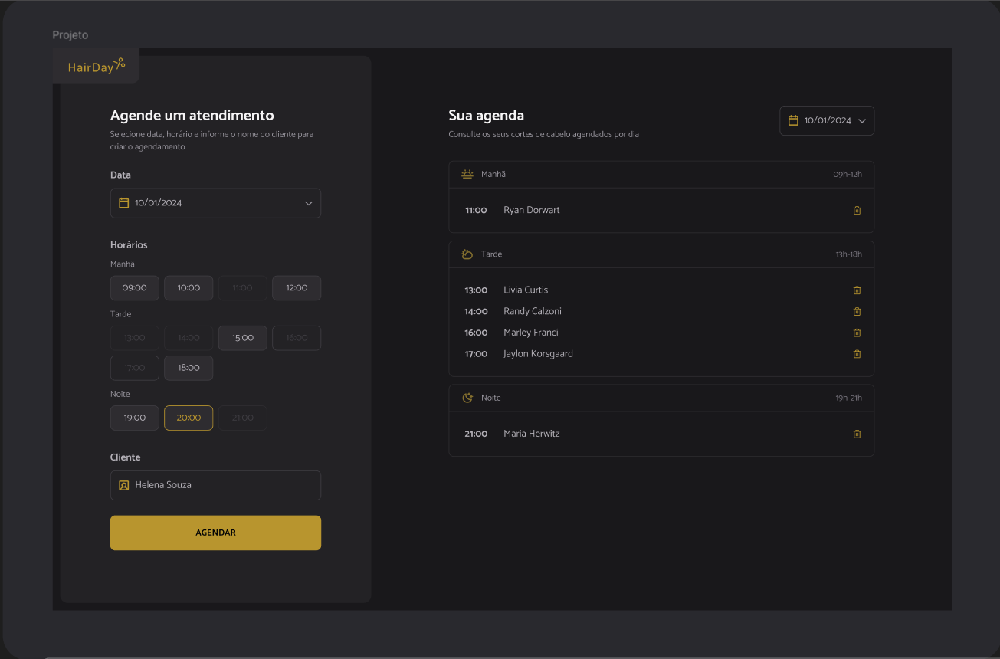

# HairDay Agendamentos

Scheduling application called Hair Day with React.js, TypeScript, Vite and Tailwind


## 🚀Links
* [Figma Design](https://www.figma.com/design/pKcAijRv2OohLCPLLJQ69u/Plataforma-de-agendamento--Community-?node-id=3-376&p=f&t=cszuXs5gEfgNZoof-0)

## 🛠️ Tech Stack
- [React](https://react.dev/) - React framework for production
- [TypeScript](https://www.typescriptlang.org/) - Programming Language
- [Tailwind CSS](https://tailwindcss.com/) - Utility-first CSS framework
- [PNPM](https://pnpm.io/pt/installation) - Package Manager
- [Vite](https://vite.dev/) - Build Tool

## 📦 Installation
1. Clone the repository 
``` bash
git clone https://github.com/Thaisfelicio/hair-day-scheduling.git
```
2. Install PNPM package manager
``` bash
npm i -g pnpm
```
3. Install dependencies
``` bash
pnpm install
```
4. Run development server
``` bash
pnpm run dev
```
Open [http://localhost:5173/](http://localhost:5173/) in your browser